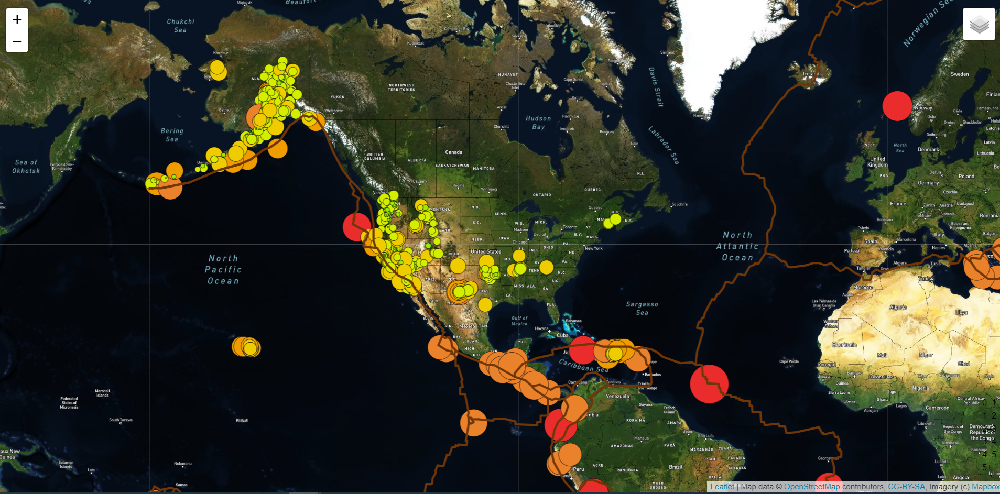

# Mapping_Earthquakes

##Overview

The objective of this project is to present earthquake GeoJSON data, create and explore interactive earthquakes maps by using layers around the world.

## Resources
Software used: HTML, JavaScript, Visual Studio Code, LEftlet, D3
Reference: mapbox.com

## Results
Earthquakes map can be viewed in the follow 3 modes and by selecting on the control page.

https://evenxu2022.github.io/Mapping_Earthquake_challenge/

